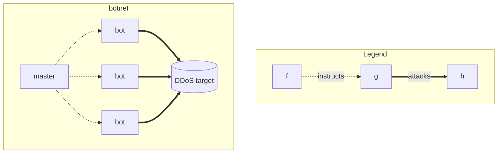
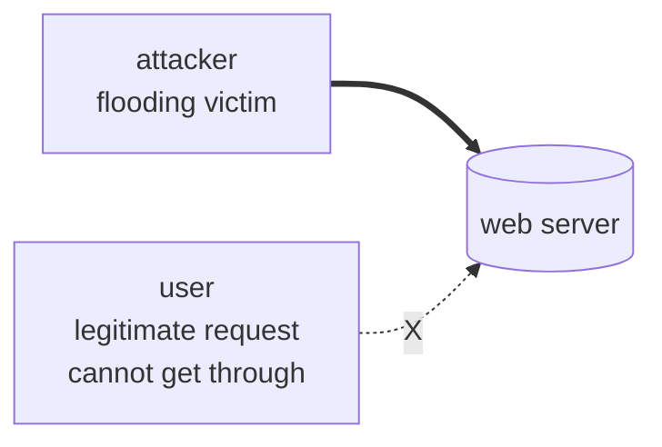
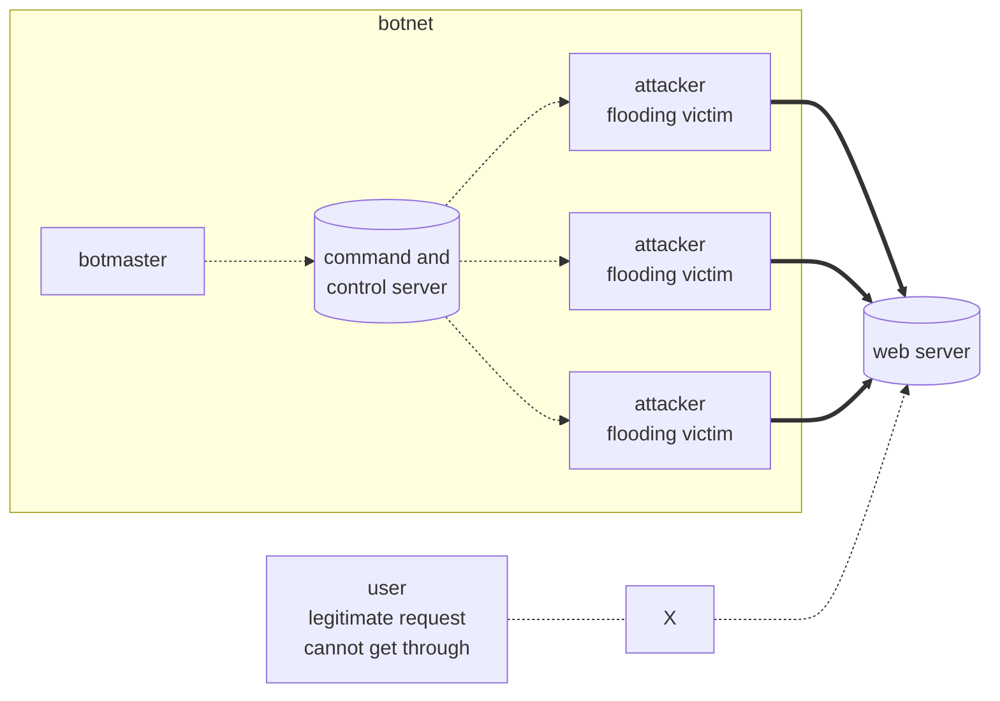
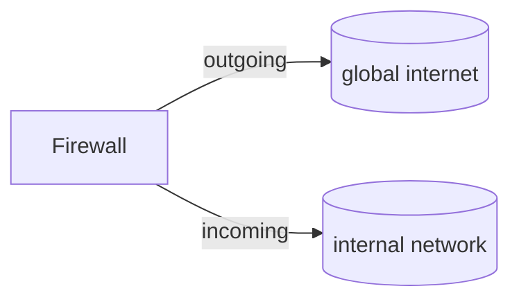

## First Default Article

let's talk about stuff right? Or not?
<!--more-->


but here's more to the descrption
- a type of malware that disguises itself as a legitimate piece of software (e. g. a PDF file, a game) in order to convince the victim to install it
- once installed, the malware is able to perform its malicious activity in the background

> [!info] Definition of Malware (NIST)
> software or firmware intended to perform an unauthorized process that will have **adverse impact on the confidentiality, integrity, or availability** of an information system. A
>
> - virus,
> - worm,
> - Trojan horse,
> - spyware,
> - ransomware,
>
> or other code-based entity that infects a host.

#### Trojan Horse


#### Virus

- malware that attches itself to a program, file, or document enabling it to spread from one computer to another
- viruses can be spread in several different ways. Some common methods of infection are through removable media, from downloads off the internet, or via email attachments (most popular today)
- can also spread through cross-site scripting vulnerabilities on the web
- **viruses require a human action (such as running an infected program) for it to spread**

##### Worm

- similar to a virus in that it spreads from computer to computer. Sometimes also considered a subcategory of viruses
- however, it spreads without human interaction
- usually explots weaknesses of the OS or weak passwords to spread over computer networks
- e. g. WannaCry

#### spyware

- spies on a user's activities without their knowledge or consent
- includes keylogging, activity monitoring, and data collection, as well as other forms of data theft (e. g. credit card data or passwords)
- usually spreads as a Trojan, or by exploiting software vulnerabilities

#### ransomware

- infects computer system of users and manipulates the the infected system in a way, that the victim cannot use it and the data stored on it
- usually the victim receives a blackmail note (e. g. as an on-screen pop-up), pressing the victimg to pay a ransom to regain full access to system and files

> [!tip] brian's free advice
>
> - never pay a ransom becuase you cannot know if paying will actually solve your problem

#### botnets

- a botnet is a set of computers infected by bots
- a bot is a piece of mailicious software that gets orders from a master. This appellation bot comes from the old chat service Internet Relay Chat (IRC), where users could develop so-called "bots" that could keep channels alive, deliver funny lines on request, etc.
- basis of distributed [[#Denial of Service Attacks]]
- bots are installed via [[#worm]] or [[#Virus]]
- e. g. StuxNext



## How to Protect against malware?

#### Anti-Virus Software

- regular updates
- reputable source
- centralised management (e. g. for patch distribution)
- alerts
- reporting (e. g. about status of all machines in your network)

### Email Filtering

- Office 365 and GMail have built-in email-filters checking for malicious content

### Web Filtering

- make sure certain requests to malicious websites are blocked by default
- often bundled with [[#Anti-Virus Software]]

### Security Awareness Training

- the biggest security loophole is the human using the computer
- make sure awareness training material is updated regularly

### Access Control & Authentication

- who is allowed to do what?
  - physical access
  - who authorizes access?
- how do you prove you are you?
  - something you know (e. g. password)
  - something you have (e. g. device or card)
  - something you are (e. g. biometrics)
  - multi-factor authentication for the win (combination of two or more of the above)
- more [[Session 3 - User authentication, access control, databases, data center and network security]]

---

## Denial of Service Attacks

> [!info] definition
>
> - occurs when legitimate users are unable to access information systems, devices, or other network resources due to the actions of a malicious cyber threat actor
> - services affected may include email, websites, online accounts (e. g. banking) or other services
> - accomplished by flooding the targeted host or network with traffic until the target cannot respond or simply crashes
> - DoS attacks will cost time and money while their resources and services are inaccessible

> [!tip] metaphor
> a real-life example for a DoS attack would be congestion on a road. Many devices (cars) flooding the same service (road) until it becomes inresponsive (congestion)

#### Overview Denial of Service



> [!success] solution
>
> - block the attacker and the DoS is over

#### Overview of Distributed Denial of Service



> [!fail] key take-aways
>
> - blocking attacker is not trivial
> - multiple machines operating together to attack one target (e. g. via [[#botnets]])
> - exponentially more requests to be sent to the target, therefore increasing attack power and increasing difficulty of attribution since the source is diversified
> - DDoS attacks are becoming more popular as more and more devices are going online through the Internet of Things

> [!success] protection
>
> - Invest in more Bandwith
>   - e. g. use a commercial CDN (e. g. CloudFlare)
> - traffic filtering/scrubbing
>   - tools specialized at identifying legitimate traffic and blocking malicious traffic
> - Cloud DDoS protection services (e. g. CloudFlare)

## How to Protect against both DoS and Malware?

### Firewall

A router designed as a buffer between any connected public networks and a private network



### Vulnerability Management

> [!info] vulnerabilities
>
> - Human Errors
> - Software Bugs
>   - regular Software Patching
>   - from reputable sources
> - Implementation Errors
> - Changes to Systems
>   - regular and secure backups
>   - backups should be immutable after creation

#### Business Continuity Planning

- what happens if we are attacked?
- e. g. how long does it take us to re-hydrate our systems from a backup

---

## Tutorial

In this assignment you are tasked with conducting a risk assessment for a Dublin based software development company, InfoSecL Software Ltd. The company is based on the top floor of an office block in Dublin city centre. It is fully fitted out with network cables, power, and its own computer room. The computer room has an (Uninterruptible Power Supply) UPS that can keep the current level of servers up and running for 15 minutes. There is one Internet Service Provider for the company and that provides 100 Mbps over a fiber connection. The company **hosts its own website within its own computer room and it is protected using a firewall**.

InfoSecL Software Ltd. has **100 users who have either a desktop or a laptop computer running the latest version of Windows**, and **25 of the staff have company issued mobile phones**. The company has its **own email server** running up to date versions of Microsoft Exchange Server and Microsoft Windows Server. It has a file and print server and also **a server used to host the company’s source code for its products**. All servers are running up to date versions of Microsoft Windows Server.

Of the **100 employees, 50 work in the software development team, each of these developers have local administrator access to computers to allow them to install and uninstall software they need for their job**.

All computers have anti-virus software installed. However, **each computer is running the anti-virus software that came bundled with the computer when it was purchased** so there are various different types of anti-virus software installed.
InfoSecL Software Ltd. develops a software package that is used by its banking clients to assess their clients’ mortgage requests. The software package is currently installed on site with each individual customer.

You as their information security manager must design a solution to reduce the likelihood of the company being a victim of a:

- Malware Attack
- DDoS Attack

Your report should outline what solutions you chose and prioritize them based on the level of risk you are trying to control, the impact the solution will have (high, medium, low), the ease of implementation (high, medium, low), and highlight any potential negative impacts of each proposed solution.

---

#### overview

```mermaid
flowchart LR
	subgraph services
		a.1["code repo server"]
		a.2["laptops/desktops"]
		a.3["email server"]
		a.4["mobile phones"]
		a.5["website"]
		a.6["print server"]
	end
	subgraph vulnerabilities<br>
		subgraph malware
			a.1 --> b.1["outdated<br>anti-virus<br>software"]
			a.2 --> b.1
			a.4 --> b.1
			a.2 --> b.2["local admin<br>rights"]
		end
		subgraph ddos
			a.5 --> b.3["100MB<br>bandwidth"]
			a.1 --> b.3
			a.5 --> b.4["custom<br>firewall"]
			a.3 --> b.5["self-hosted"]
			a.6 --> b.5
		end
	end
	subgraph mitigations
		b.1 --> c.1["remote controlled<br>anti-virus<br>software"]
		b.2 --> c.1
		b.2 --> c.3["employee<br>education"]
		b.2 --> c.4["access control<br>list"]
		b.3 --> c.2["cloud-based<br>solution"]
		b.4 --> c.2
		b.5 --> c.2
		b.3 --> c.5["more bandwidth"]
	end
```

#### vulnerable services (importance)

- code repo server (HIGH)
- computers (HIGH)
- email server (HIGH)
- mobile phone (HIGH)
- website (MEDIUM)
- print server (LOW)

#### risks enabling Malware / DDoS (risk)

- outdated anti-virus software (HIGH)
- small bandwidth of just 100 MB/s (HIGH)
  - with home-office 100MB/s going into the code repo is not much
  - video-calls going out
- self-hosted code repo (HIGH)
  - low USP of just 15 minutes
  - what if someone checks-in malware into the repo? (is it a distribution channel?)
  - are there scans for malicious dependencies in the code?
- local administrator rights at ~50% of the devices (MEDIUM)
  - entrance for malware if user not careful
- custom built firewall for website (MEDIUM)
  - how up to date is the firewall software?
  - what happens if it is down?
- self-hosted email servers with limited security features (MEDIUM)
  - how good is the email filtering?
  - does our own server scan attachments?
  - are there warnings that identify external email-addresses as such?
- maintenance of self-hosting everything is expensive and prone to errors (MEDIUM)

### mitigations (impact/effort)

- remote controlled anti-virus software on each device (HIGH/MEDIUM)
  - does our current provider offer remote-controlled versioning?
  - negative-effects: users will be annoyed by regular updates
- more bandwidth (HIGH/LOW)
  - should be a simple matter of negotiating new contract with ISP
  - negative-effects: more expensive
- cloud based code repo (HIGH/MEDIUM)
  - GitHub scans for known malware in dependencies and warns
  - external, highly reliable hosting and firewalls
  - negative-effects: migrating the repo is not trivial and takes time
- cloud based email (MEDIUM/HIGH)
  - negative-effects: more expensive
- access control lists (MEDIUM/HIGH)
  - who gets local admin rights?
  - negative-effects: users will be annoyed by missing right and additional red tape
- employee education (HIGH/HIGH)
  - onboarding for users with and without admin rights
  - regular security trainings with follow-up tests (e. g. send a phishing email to check if awareness has incread)
- cloud based firewall (MEDIUM/MEDIUM)

**Literature:**

- [Mitigating malware and ransomware attacks - NCSC.GOV.UK Links to an external site.](https://www.ncsc.gov.uk/guidance/mitigating-malware-and-ransomware-attacks)
- [Protecting Against Ransomware | CISA Links to an external site.](https://www.cisa.gov/uscert/ncas/tips/ST19-001)
- [Mitigation steps for businesses | The No More Ransom Project Links to an external site.](https://www.nomoreransom.org/en/prevention-advice-for-businesses.html)
- [Denial of Service (DoS) guidance - NCSC.GOV.UK Links to an external site.](https://www.ncsc.gov.uk/collection/denial-service-dos-guidance-collection)
- [Understanding Denial-of-Service Attacks | CISA Links to an external site.](https://www.cisa.gov/uscert/ncas/tips/ST04-015)
- UDP Based Denial-of-Service (DoS) Attack- [NCSC: Emails From CSIRT Links to an external site.](https://www.ncsc.gov.ie/emailsfrom/Resources/UDP-DoS-Attack/)
- [ENISA Threat Landscape 2020 - Distributed denial of service — ENISA (europa.eu) Links to an external site.](https://www.enisa.europa.eu/publications/enisa-threat-landscape-2020-distributed-denial-of-service)
- [DDoS Overview and Response Guide (europa.eu) Links to an external site.](https://cert.europa.eu/static/WhitePapers/CERT-EU_Security_Whitepaper_DDoS_17-003.pdf)
